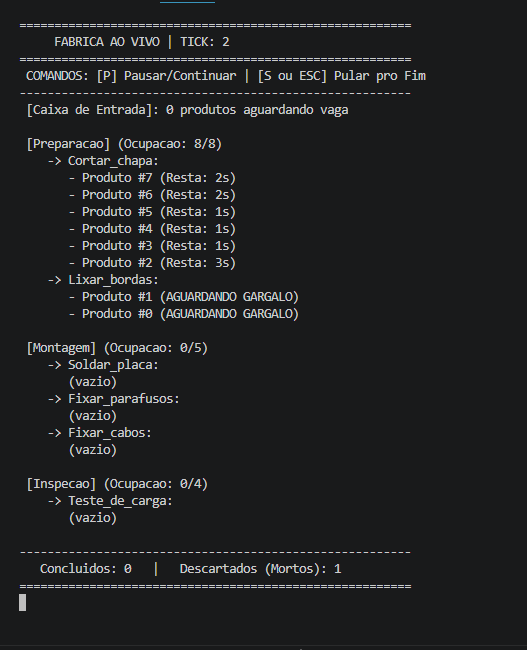

# Simulador de Linha de Produção Industrial


O **Simulador de Linha de Produção Industrial** é um projeto desenvolvido em **C** com o objetivo de simular o funcionamento de uma linha de produção composta por diversas etapas e atividades. Durante a execução, produtos percorrem a linha produtiva, podendo enfrentar filas, tempos de espera, falhas operacionais e descarte por falhas críticas.

Ao final da simulação, o sistema gera um relatório completo contendo métricas de desempenho da fábrica, das etapas, das atividades e de cada produto processado.

---

# Problema

Em processos industriais, alterações na capacidade produtiva, tempos de processamento e taxas de falha podem gerar gargalos, reduzir a produtividade e aumentar os custos.

Realizar testes diretamente em uma linha de produção real pode ser caro, demorado e arriscado.

Este projeto busca reproduzir esses cenários em um ambiente virtual, permitindo analisar o comportamento da linha de produção antes da implementação de mudanças reais.

---

# Objetivos

* Simular o fluxo de produtos em uma linha de produção.
* Modelar filas entre etapas da produção.
* Simular falhas operacionais e falhas críticas.
* Gerar indicadores de desempenho.
* Demonstrar a utilização de estruturas de dados dinâmicas em C.

---

# Funcionalidades

* Leitura automática da configuração da fábrica através de arquivo de entrada.
* Simulação baseada em ticks (tempo discreto).
* Controle da capacidade máxima de cada etapa.
* Sistema de filas FIFO.
* Simulação de falhas probabilísticas.
* Reprocessamento de produtos após falhas.
* Descarte automático em caso de falha crítica.
* Registro completo do histórico de processamento de cada produto.
* Geração automática de relatório em arquivo `.txt`.
* Modo Fast Forward para acelerar a simulação.

---

## Conceitos Aplicados

Durante o desenvolvimento deste projeto foram aplicados diversos conceitos de programação, incluindo:

* Alocação dinâmica de memória (`malloc` e `free`);
* Modularização utilizando arquivos `.h` e `.c`;
* Manipulação de arquivos de texto;
* Geração de números pseudoaleatórios;
* Estruturas de dados dinâmicas:

  * Lista simplesmente encadeada;
  * Lista duplamente encadeada;
  * Fila (FIFO);
  * Pilha (LIFO);
  * Árvore Binária de Busca (BST);
* Organização modular do código;
* Simulação baseada em eventos discretos (ticks).


---

# Arquitetura

```
  Entrada (arquivo)

         │
         ▼

Fila de Entrada (FIFO)

         │
         ▼

┌──────────────────┐
│     Etapa 1      │
│ Ativ.1 → Ativ.2  │
└──────────────────┘

         │
         ▼

┌──────────────────┐
│     Etapa 2      │
│ Ativ.1 → Ativ.2  │
└──────────────────┘

         │
         ▼

        ...

         │
         ▼

    Última Etapa

         │

  ┌──────┴──────┐

  ▼             ▼

Concluído   Descartado
```

---

# Organização do Projeto

```
include/
   ├── atividades.h
   ├── etapas.h
   ├── produtos.h
   ├── fila.h
   ├── pilha.h
   ├── arvore.h
   ├── descarte.h
   ├── ativos.h
   └── utils.h

src/ 
   ├── Main.c
   ├── atividades.c
   ├── etapas.c
   ├── produtos.c
   ├── fila.c
   ├── pilha.c
   ├── arvore.c
   ├── descarte.c
   ├── ativos.c
   └── utils.c
```

---

# Arquivo de Entrada

A simulação é configurada através de um arquivo de texto formado por:
| Campo       | Descrição                                           |
| ----------- | --------------------------------------------------- |
| `SIMULACAO` | Nome da simulação, semente aleatória e tempo máximo |
| `PRODUTOS`  | Quantidade de produtos, taxa de entrada e nome      |
| `ETAPA`     | Define uma etapa da linha de produção               |
| `ATIVIDADE` | Define uma atividade pertencente à etapa atual      |

Estrutura do Arquivo:

```
SIMULACAO [nome_simulacao] [semente_para_numeros_aleatorios] [limite_tempo_seg]
PRODUTO <quantidade_a_produzir> <taxa_produtos_por_seg> <nome_produto>
LINHA_PRODUCAO <quantidade_etapas>
ETAPA <id> <quantidade_atividades> <capacidade_total> <taxa_falha_inicial> [nome]
ATIVIDADE <id> <tempo_para_finalizar_atividade> <taxa_falha> [nome]

```
Exemplo de um arquivo preenchido:
```
SIMULACAO linha_producao_widgets_v1 42 10000
PRODUTO 80 3 Widget-A
LINHA_PRODUCAO 3
ETAPA 1 2 8 0.02 Preparacao
ATIVIDADE 1 3 0.02 Cortar_chapa
ATIVIDADE 2 2 0.01 Lixar_bordas
ETAPA 2 3 5 0.01 Montagem
ATIVIDADE 1 5 0.07 Soldar_placa
ATIVIDADE 2 3 0.04 Fixar_parafusos
ATIVIDADE 3 4 0.05 Fixar_cabos
ETAPA 3 1 4 0.02 Inspecao
ATIVIDADE 1 10 0.05 Teste_de_carga

```

---

# Arquivo de Saída

Ao término da simulação é gerado automaticamente um relatório contendo:

### Informações Gerais

* identificador da simulação;
* duração;
* produtos concluídos;
* falhas totais;
* tempo médio na linha;
* tempo médio em filas.

### Métricas das Etapas

* quantidade de produtos processados;
* tempo mínimo;
* tempo médio;
* tempo máximo;
* falhas por etapa.

### Métricas das Atividades

* vazão;
* tempo médio em fila;
* tempo médio de execução.

### Histórico dos Produtos

Para cada produto são registrados:

* criação;
* entrada na linha;
* saída;
* falhas;
* todas as atividades executadas;
* tempo gasto em cada etapa.

---

# Tecnologias Utilizadas

* Linguagem C
* GCC
* Visual Studio Code
* Estruturas de Dados Dinâmicas
* Manipulação de Arquivos
* Geração de Relatórios

---

# Como Compilar

```
gcc src/*.c -Iinclude -o simulador
```

---

# Como Executar
no terminal faça:

```
./simulador
```

ou, no Windows:

```
simulador.exe
```

Após iniciar o programa, informe o arquivo de configuração da simulação.

---

# Resultados

Ao final da execução, é criado automaticamente um arquivo de relatório contendo todas as métricas obtidas durante a simulação.
```
=== METADADOS ===
id_simulacao: simulacao_20260707_2240
semente_utilizada: 55
arquivo_entrada: input.txt
tick_fim: 1000
produtos_concluidos: 8
tempo_medio_linha: 30.63
tempo_medio_espera: 5.13
falhas_totais: 1
Meta alcancada: sim
Produtos faltantes: 0

=== RELATORIO DA SIMULACAO Widget-A ===
------- RELATORIO DAS ETAPAS -----------------
ETAPA 1 Preparacao:
Atividades: 2
Quantidade de falhas: 1
Falhas por produto: 0.13
Tempo minimo: 3
Tempo medio: 7.38
Tempo maximo: 16
Tempo medio em fila: 6.13

------- RELATORIO DAS ATIVIDADES--------------
ETAPA 1 Preparacao:
ATIVIDADE 1 Cortar_chapa:
Capacidade: 8
Vazao: 8
Tempo de execucao: 3
Tempo medio em fila: 0.13
Tempo medio total: 3.13

------- RELATORIO DOS PRODUTOS ----------------
--- PRODUTO 2 ---
Modelo: Widget-A
Criacao: tick 0
Entrada na linha: tick 0
Saida da linha: tick 38
Tempo total: 38 ticks
Tempo em espera: 10 ticks
Falhas: 1
Trajetoria:
Etapa 1 tentativa 1:
Atividade 1 (Cortar_chapa) fila:0 inicio:0 fim:2 FALHOU
Ticks na etapa: 2 ticks
Etapa 1 tentativa 2:
Atividade 1 (Cortar_chapa) fila:2 inicio:3 fim:5 OK
Atividade 2 (Lixar_bordas) fila:5 inicio:17 fim:16 OK
Ticks na etapa: 14 ticks
Etapa 2 tentativa 1:
Atividade 1 (Soldar_placa) fila:16 inicio:17 fim:21 OK
Atividade 2 (Fixar_parafusos) fila:21 inicio:22 fim:24 OK
Atividade 3 (Fixar_cabos) fila:24 inicio:25 fim:28 OK
Ticks na etapa: 12 ticks
Etapa 3 tentativa 1:
Atividade 3 (Teste_de_carga) fila:28 inicio:29 fim:38 OK
Ticks na etapa: 10 ticks

```

Os arquivos são armazenados na pasta `relatorios/` e recebem nomes sequenciais para evitar sobrescrever execuções anteriores.

Um exemplo completo do relatório gerado pode ser encontrado em [relatorio_producao.txt](relatorio_producao.txt).

---
# Captura de Tela



---
## Autores

**Renan Soares Souza**


Projeto desenvolvido para fins acadêmicos e como demonstração de conhecimentos em programação em C, estruturas de dados e simulação de sistemas.


